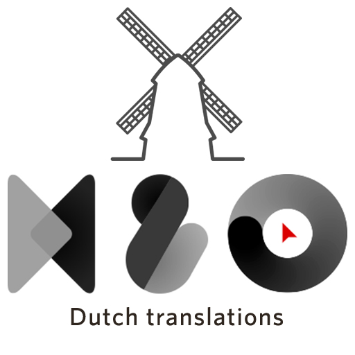

# H&O Magento 2 Nederlandse vertalingen / Dutch Translations

- Complete translations for Magento 2.x CE and EE.
- Added Dutch [address formatting](src/etc/config.xml)

## Installation through Marketplace

As H&O extensions are offered in the official Magento® Marketplace you can directly install them via the Magento® 2 backend. Magento® did a great job simplifying this process, they also provided a really good documentation. Please read the official documentation for installing extensions over the marketplace. 

https://marketplace.magento.com/honl-magento2-nl-nl.html
http://devdocs.magento.com/guides/v2.0/comp-mgr/module-man/compman-start.html

## Installation through composer

```BASH
composer require honl/magento2-nl-nl
```

### Development install:
```BASH
composer require honl/magento2-nl-nl "dev-master"
```


## Contributing
Go to https://crowdin.com/project/magento-2/nl#/Head and translate files.


Import translations:
```
curl http://107.170.242.99/build.php
cd vendor/honl/magento2-nl-nl
wget -O nl_NL.csv http://107.170.242.99/var/Head/source_nl_NL.csv
git commit -am"Imported translations from crowdin"
git push

```

## How are translations files loaded

In the file `Magento\Framework\App\Language\Dictionary::readPackCsv` all ``*.csv` files are loaded, no specific filename
required.
